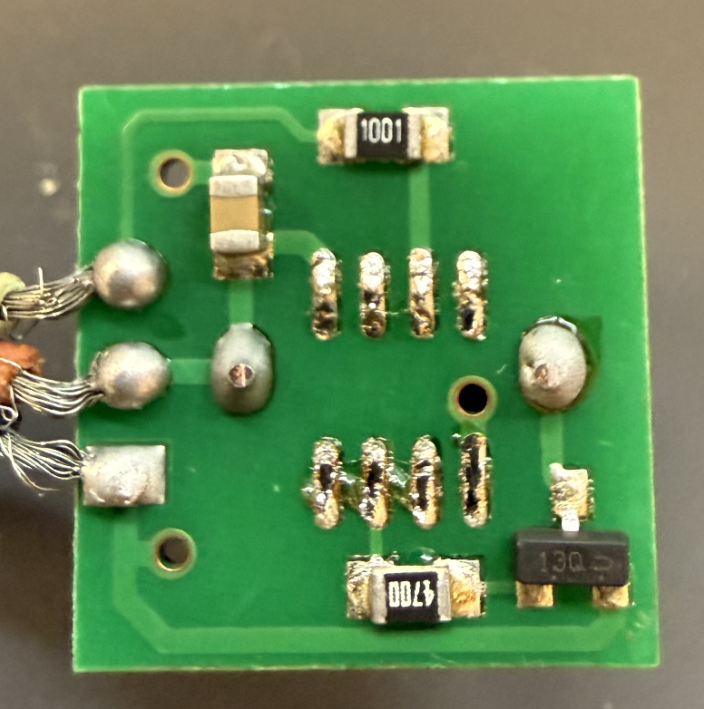
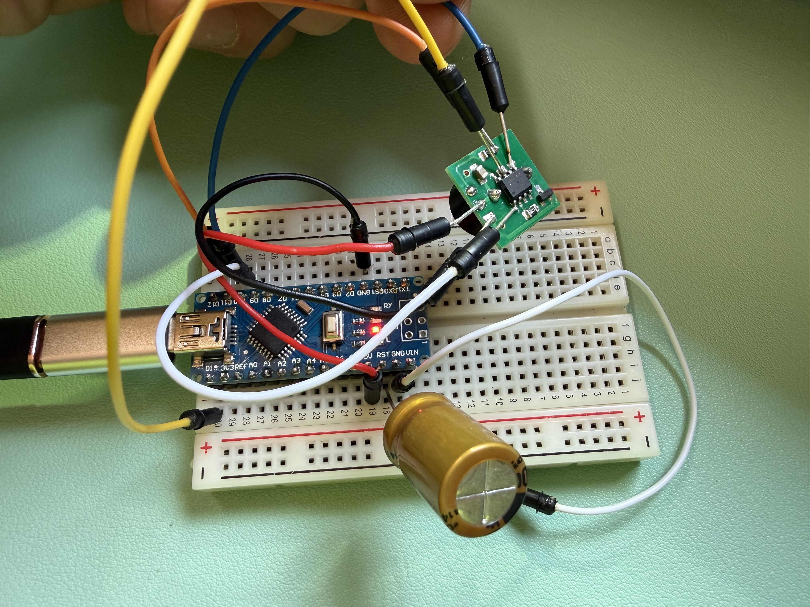

# Custom Firmware for Lost Model Buzzer on ATtiny13A

> How I found an old buzzer in a drawer and turned it into a smart beeper with auto-calibration — using just 2 pins and 676 bytes of code. Plus a deep dive into piezo physics.

## Background

I needed a buzzer for my quadcopter. Dug through my old parts drawer from the HobbyKing days — found a buzzer board based on ATtiny13A. The original firmware was designed for PWM signal input, which doesn't work with Betaflight. Betaflight uses a simple digital signal on the BUZ- pad — just LOW to beep, HIGH to stop.

Decided to write custom firmware that would work with Betaflight's buzzer output.


## How Betaflight Buzzer Works

Betaflight controls the buzzer through the `BUZ-` pad. The logic is inverted:
- **BUZ- = LOW** → beep
- **BUZ- = HIGH** → silence

The problem with cheap buzzers — they just apply constant voltage to the piezo. But piezo elements work best at their resonant frequency (typically 2-4 kHz). Generate a square wave at this frequency and the volume increases dramatically.

## The Idea

Put a microcontroller between the FC and piezo element that:
1. Listens to the BUZ- signal from the flight controller
2. Generates a square wave at the optimal frequency
3. Allows calibrating the frequency for the specific piezo element

## Board Investigation

Removed the ATtiny13A from the board to examine the traces:



The board uses only **2 pins** for the actual function:
- **PB1** (pin 6) — input signal from FC (BUZ-)
- **PB3** (pin 2) — output to transistor (piezo control)

This minimal design means we can use PB1 for both signal input AND calibration entry — no extra button needed!

## Firmware Design

### Minimal Pin Usage

The key insight: **reuse the signal pin for calibration**. At startup, if PB1 is LOW (shorted to GND), enter calibration. Otherwise, normal operation.

```
Power on
    │
    ▼
PB1 = LOW? ──yes──▶ Calibration mode
    │
   no
    ▼
Normal mode (listen to FC)
```

### Auto-Save Calibration

Traditional approach: sweep frequencies, press button to select, press again to save. Tedious.

My approach: **save each frequency BEFORE playing it**. When you hear the best tone — just power off. It's already in EEPROM!

```
Calibration loop:
┌─────────────────────┐
│ Save freq to EEPROM │ ◀── saved BEFORE you hear it
│ Play tone (1.5 sec) │
│ Pause (0.5 sec)     │
│ freq += 100 Hz      │
└─────────┬───────────┘
          │
    User powers off
    when it sounds best
          │
          ▼
    Frequency saved ✓
```

This eliminated the need for button handling code, saving ~300 bytes.

### Software PWM on PB3

PB3 doesn't have hardware PWM (only PB0/PB1 have timer outputs). Solution: timer interrupt with software toggle. For a buzzer, the ~1-2% jitter is completely inaudible.

## The Quest for the Perfect Frequency

This turned into a rabbit hole. What started as "just find the loudest frequency" became a full research project with custom tools and surprising discoveries.

### Attempt #1: Mobile Apps (Failed)

First idea — use a dB meter app (Phyphox, Decibel X) during calibration sweep:

**Problem:** These apps show overall loudness, not frequency vs dB. I could see the needle jump, but couldn't tell *which* frequency caused it.

Phyphox can export FFT snapshots, but that's useless for a sweep where frequency changes every 2 seconds.

### Attempt #2: Phyphox FFT Export (Misleading)

Exported FFT data from Phyphox and wrote `analyze_spectrum.py` to analyze it.

**Results looked wrong:**
| Freq | Max dB | Detected |
|------|--------|----------|
| 4500 Hz | -26.7 | 4048 Hz ❌ |
| 2600 Hz | -26.8 | 2595 Hz ✓ |

The "loudest" frequency (4500 Hz) was detected at 4048 Hz — way off! But 2600 Hz was accurate. Something was fishy.

### Attempt #3: Custom Real-Time Analyzer

Wrote `buzzer_analyzer.py` — a proper spectrum analyzer:
- Real-time audio capture from MacBook microphone
- FFT analysis focused on buzzer frequency range
- Auto-detection of calibration sweep start (finds the 2 intro beeps)
- Tracks peak frequency, dB, and harmonics
- Maps each tone to expected frequency by order, not timing

```bash
source venv/bin/activate
python3 buzzer_analyzer.py --record
```

### Attempt #4: Fine-Tuning the Step (Overkill)

Thought: "Maybe 100 Hz step is too coarse, let's try 10 Hz!"

Changed firmware to 10 Hz steps (60 frequencies, 2 minute sweep). Results:

| Input Range | Detected | Conclusion |
|-------------|----------|------------|
| 2400-2480 Hz | 2422 Hz | All same! |
| 2490-2560 Hz | 2508 Hz | All same! |
| 2570-2650 Hz | 2605 Hz | All same! |
| 2660-2750 Hz | 2702 Hz | All same! |

**The piezo was "locking" onto discrete frequencies regardless of input!**

### The Research Phase

This sent me down a research rabbit hole. Turns out piezo buzzers have:

1. **Discrete resonance modes** — not a smooth frequency response
2. **High Q factor** — narrow bandwidth (~200 Hz) around each mode
3. **Multiple vibration modes** — radial, thickness, edge modes

My piezo's modes are spaced ~90 Hz apart. That's why:
- 10 Hz steps were pointless (piezo snaps to nearest mode)
- 100 Hz steps are actually optimal (matches mode spacing)
- The "4500 Hz is loudest" was an artifact (piezo couldn't produce it, fell back to 4048 Hz resonance)

See `PIEZO_RESEARCH.md` for full details and sources.

### Final Analysis

With proper understanding, re-analyzed the data:

| Mode | Frequency | Max dB | Verdict |
|------|-----------|--------|---------|
| #1 | 2422 Hz | -31.6 dB | Quiet |
| #2 | 2508 Hz | **-19.1 dB** | **WINNER** |
| #3 | 2605 Hz | -21.3 dB | Good |
| #4 | 2702 Hz | -20.2 dB | Good |
| #5 | 2799 Hz | -27.8 dB | Meh |
| #6 | 2917 Hz | -25.4 dB | Meh |

**Winner: 2500 Hz** — hits mode #2 perfectly, loudest response.

### Why Lower Frequencies Are Better Anyway

Even if higher frequencies were louder, for finding a lost quad in grass:

| Factor | Low (2400-2700 Hz) | High (3500+ Hz) |
|--------|-------------------|-----------------|
| Grass penetration | ✓ Better | ✗ Absorbed |
| Distance carry | ✓ Farther | ✗ Shorter |
| Frequency accuracy | ✓ Precise | ✗ Distorted |
| Harmonics | ✓ Rich | ✗ Few |

Lower frequencies win on all practical metrics.

### Lessons Learned

1. **Don't trust raw dB readings** — check if detected frequency matches expected
2. **Piezo ≠ speaker** — discrete modes, not smooth response
3. **Finer isn't always better** — 10 Hz steps were pointless due to physics
4. **Build proper tools** — 30 minutes writing an analyzer saved hours of guessing
5. **Research before optimizing** — understanding the physics changed everything

### Calibration (Final Version)

Firmware now uses: **2400-3000 Hz, step 100 Hz (~12 sec sweep)**

1. Short BUZ- wire to GND
2. Power on — 2 beeps at 2500 Hz confirm calibration mode
3. Listen to 7 frequencies (2400, 2500, 2600... 3000)
4. Power off when you hear the best one — it's saved!

Or use the analyzer for precise measurement:
```bash
python3 buzzer_analyzer.py --record
```

## Flashing via Arduino Nano

Used an Arduino Nano as ISP programmer:



### Wiring

```
Arduino Nano              ATtiny13A
────────────              ─────────
                         ┌────┬────┐
D10 ────────────────────▶│1 RST  8│◀── 5V
                         │2 PB3  7│◀── D13 (SCK)
                         │3 PB4  6│◀── D12 (MISO)
GND ────────────────────▶│4 GND  5│◀── D11 (MOSI)
                         └────────┘
```

**CRITICAL:** Capacitor (10µF-1000µF) between RST and GND on Nano!

### Troubleshooting

| Error | Cause | Solution |
|-------|-------|----------|
| `not in sync: resp=0x15` | Nano auto-resets | Add capacitor RST↔GND |
| `not in sync: resp=0x00` | Nano held in reset | Remove direct RST-GND short, use capacitor |
| `programmer is not responding` | ArduinoISP not loaded | Upload ArduinoISP to Nano first |
| Fuse verification error | CKDIV8 won't clear | Compile for 1.2 MHz (F_CPU=1200000UL) |

### Commands

```bash
# 1. Upload ArduinoISP to Nano first (Arduino IDE)
#    File → Examples → 11.ArduinoISP → Upload

# 2. Compile buzzer firmware
make

# 3. Flash fuses (once, sets 9.6 MHz clock)
avrdude -c arduino -p t13 -P /dev/cu.usbserial* -b 19200 \
  -U lfuse:w:0x7A:m -U hfuse:w:0xFF:m

# 4. Flash firmware
avrdude -c arduino -p t13 -P /dev/cu.usbserial* -b 19200 \
  -U flash:w:buzzer.hex:i
```

## Result

The buzzer is significantly louder now. The journey from "let's just pick 3 kHz" to finding the actual optimal frequency taught me more about piezo physics than I expected.

**Key discovery:** My piezo's resonance modes are at 2422, 2508, 2605, 2702, 2799, 2917 Hz. Mode #2 (2508 Hz) is the loudest at -19.1 dB. Setting the firmware to 2500 Hz hits this mode perfectly.

**Final stats:**
- **676 bytes** of 1024 (66% of flash)
- **2 pins** used (PB1 input, PB3 output)
- **0 buttons** required for calibration
- **~12 sec** calibration sweep (2400-3000 Hz, 100 Hz steps)
- **2500 Hz** default frequency (optimal for this piezo)
- Works at both 1.2 MHz (factory default) and 9.6 MHz clock

## Project Files

| File | Description |
|------|-------------|
| `main.c` | Firmware source code |
| `Makefile` | Build and flash commands |
| `buzzer_analyzer.py` | Real-time spectrum analyzer for calibration |
| `analyze_spectrum.py` | Static FFT analysis (Phyphox CSV) |
| `PIEZO_RESEARCH.md` | Research notes on piezo frequency response |
| `pinout.png` | ATtiny13A pinout and board photo |
| `pcb_traces.png` | PCB traces (chip removed) |
| `programmer.jpg` | Arduino Nano ISP programmer setup |

## Quick Start

If you just want to use the firmware:

```bash
# Clone
git clone https://github.com/petrochen/attiny13a-buzzer.git
cd attiny13a-buzzer

# Compile (needs avr-gcc)
make

# Flash via USBasp
make flash
```

Or download `buzzer.hex` from releases and flash with your preferred programmer.

## Links

- [ATtiny13A Datasheet](https://ww1.microchip.com/downloads/en/DeviceDoc/ATtiny13A-Data-Sheet-DS40002307A.pdf)
- [Betaflight Buzzer Configuration](https://betaflight.com/docs/wiki/configurator/buzzer-tab)
- [Arduino as ISP](https://docs.arduino.cc/built-in-examples/arduino-isp/ArduinoISP)

## License

MIT License. See [LICENSE](LICENSE) for details.

---

*January 2026*
